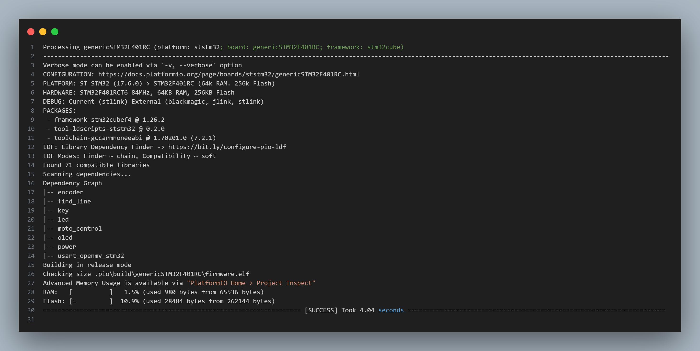

# STM32F401 芯片架构与开发环境搭建文档

## 1. 引言
本文档记录了 STM32F401 芯片的架构，以及在 Windows 和 Ubuntu 系统上搭建 VSCode + PlatformIO + CubeMX 的开发环境的过程。此文档旨在为团队成员提供清晰的指导，便于进行项目开发和代码同步。

## 2. STM32F401 芯片架构
- **处理器**: ARM Cortex-M4
- **主频**: 高达 84 MHz
- **存储**:
  - Flash 存储: 512 KB
  - SRAM: 128 KB
- **外设**:
  - GPIO, USART, SPI, I2C, ADC, DAC 等
- **电源**: 3.3V
- **特点**:
  - 支持浮点运算和 DSP 指令集，适合高性能应用。
  - 低功耗模式，适合电池供电设备。

## 3. 开发环境搭建

由于团队成员工作设备不统一，为方便 Git 同步，故采用 VSCode + PlatformIO 开发环境。Windows 端的配置相对简单，各软件都有一键安装包且无需自主配置交叉编译器，其安装步骤此处省略。

### 3.1 系统准备
确保 Ubuntu 系统已更新，并安装了基本工具：
```bash
sudo apt update
sudo apt upgrade
sudo apt install build-essential git
```

### 3.2 安装 VSCode
```bash
sudo snap install --classic code
```

### 3.3 安装 PlatformIO
 - 在 VSCode 的侧边栏中，进入 Extensions（扩展）界面，搜索并安装 PlatformIO。
  
### 3.4 配置 ARM 交叉编译器
PlatformIO 默认提供了 STM32 的支持，但确保 ARM 交叉编译器可用：
1. 下载[开源ARM工具链](https://developer.arm.com/tools-and-software/open-source-software/developer-tools/gnu-toolchain/gnu-rm/downloads)
2. 解压，cp至/usr/local/arm/
3. vim /etc/profile添加如下内容
```
export PATH=$PATH:/usr/local/arm/bin
export LD_LIBRARY_PATH=$LD_LIBRARY_PATH:/usr/local/arm/lib
```
4. source刚刚修改的配置文件


### 3.4 安装 CubeMX
1. 下载 CubeMX 安装包
2. 给予执行权限并运行：
   ```bash
   chmod +x [CubeMX Installer]
   ./[CubeMX Installer]
   ```

### 3.5 项目移植
PlatformIO与CubeMX虽然相互兼容，但其工程目录结构还是有所差异。
1. 由于CubeMX每次更改配置都会重新生成代码，故此处更改PlatformIO的配置文件以适应CubeMX的目录结构，platformio.ini内容如下：
```
[env:genericSTM32F401RC]
platform = ststm32
board = genericSTM32F401RC
framework = stm32cube
upload_protocol = stlink
debug_tool = stlink
lib_extra_dirs = lib

[platformio]
src_dir = Core/Src
include_dir = Core/Inc
```
2. 对于外设的库文件，我们将其从Drivers目录移动至lib目录，以适应 PlatformIO 的目录规范。
3. 编译烧录调试功能均正常。
  

## 4. 使用 Git 上传
- 初始化 Git 仓库并添加远程：
```bash
git init
git remote add origin https://github.com/iodinot/5g_car.git
```
- 提交代码并推送：
```bash
git add .
git commit -m "Initial commit"
git push -u origin master
```

- [项目仓库: https://github.com/iodinot/5g_car.git](https://github.com/iodinot/5g_car.git)

## 5. 结论
本指南成功搭建了 STM32F401 的开发环境，后续可以开始项目开发。确保在开发过程中遵循良好的编程实践，并定期将代码推送到远程仓库。

## 6. 参考文献
- STMicroelectronics 官方文档
- PlatformIO 官方文档
